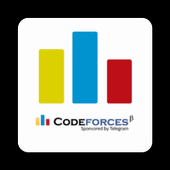

	<body>
    
    </body>

## I'm a
 - **Full Stack Developer**
 - **Cybersecurity Enthusiast**
 - **Competitive Coder**

## I love to:
 - **Contribute to Open Source**
 - **Participate in CTFs**
 - **Participate in Coding Contests**
 - **Learning about new technologies**

- 👨‍🎓 Currently a Sophomore at **Dept. of Computer Science and Technology, IIEST, Shibpur**
- 💻 Prior experience with **NuxtJS, VueJS, JavaScript, Python, Flutter, C** and **C++**
- 📫 Feel free to contact me **arnabsen1729@gmail.com**

<h4 align="center"> thanks to <a href="https://github.com/sadn1ck">@sadn1ck</a></h4>

